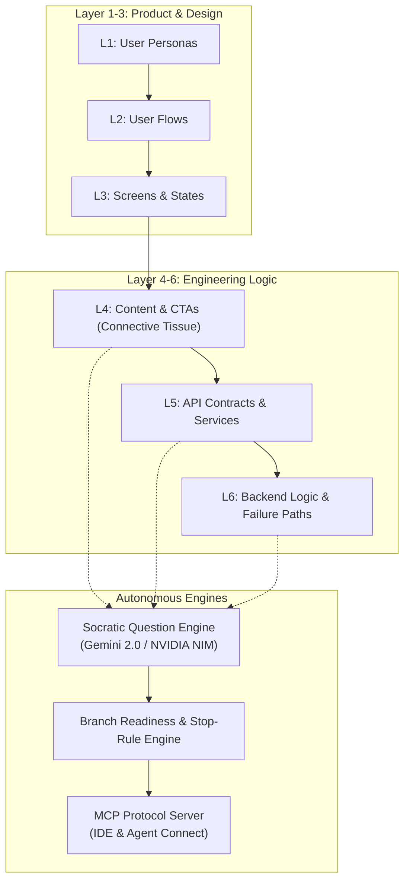

# 🧠 SpecGraph / Blueprint — Second Brain Map of Content (MOC)

> **Project Mission**: Reimagining the PRD into an Agentic, Clickable Information Architecture Graph that bridges human product design and autonomous agent code generation.
> **Dual Hackathon Target**: **Google AI Builder Cup 2026** & **NVIDIA Hackathon 2026**.

---

## 📌 Core Navigation

| Section | Description | Status |
| :--- | :--- | :--- |
| [[01_Executive_Summary_and_Thesis]] | The thesis: "The Spec is the New Source Code" & problem-solution fit | Completed |
| [[02_System_Architecture_and_Data_Model]] | 6-Layer Semantic Zoom schema, CTA connective tissue, JSON schemas | Completed |
| [[03_Socratic_Question_Engine_and_Stop_Rules]] | Agentic interview engine, node checklists, "Assumption is not approval" | Completed |
| [[04_Dual_Hackathon_Strategy_Google_vs_NVIDIA]] | How we build a single unified core and win both competitions | Completed |
| [[05_Competitive_Landscape_Archify_and_Others]] | Deep dive on Archify, AWS Kiro, Spec Kit, Plane, and our moats | Completed |
| [[06_Engineering_Roadmap_from_Scratch]] | Phase 0 to Phase 4 implementation plan, tech stack, and milestones | Completed |
| [[07_PCOS_Reference_Flow_Model]] | Canonical reference benchmark (W05 Checkout $\to$ W06 Payment $\to$ API32/42) | Completed |
| [[08_Google_AI_Builder_Cup_2026_Submission_Dossier]] | Complete submission entry form, pitch deck, video script, Cloud Run deploy | Completed |
| [[09_Founder_Registration_Copy_and_Forms]] | Copy-paste registration answers in natural founder voice (Anuroop persona) | Completed |
| [[10_SI_Product_Master_PRD]] | **Master PRD v1.0**: 5-stage evolutionary pipeline, universal plugins, dual-track specs | Completed |
| [[11_SI_Product_Hive_Requirements_and_Architecture]] | **The Hive Requirements**: Gamified multi-agent Bees (Frontend, Backend, Design, Tester), player roster, Q&A game | Completed |
| [[12_Market_Research_and_Competitive_Intelligence]] | **Market Research**: 25% rework metric, 1-10-100 cost rule, competitor matrix (ChatPRD, Archify, UXMagic) | **Completed (Final)** |

---

## 🏷️ Key Tags
#specgraph #agentic-ia #dual-hackathon #google-builder-cup #nvidia-hackathon #mcp #socratic-engine #graph-architecture

---

## ⚡ Quick Architecture Summary

