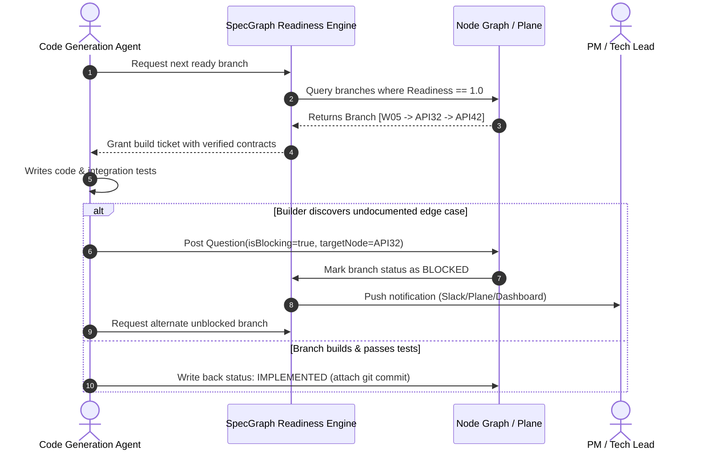

# 03. Socratic Question Engine & Stop Rules

> **Tags**: #question-engine #socratic #agentic-spec #stop-rules
> **Parent**: [[00_Map_of_Content]] | **Next**: [[04_Dual_Hackathon_Strategy_Google_vs_NVIDIA]]

---

## 🧐 The Philosophy: "Assumption is Not Approval"

Autonomous coding agents (e.g., Devin, Claude Code, GitHub Copilot Workspace) frequently produce broken production software because of **unconstrained hallucination of business policies**:
- When an API timeout is unstated, the agent defaults to infinite wait or silent crash.
- When an address failure occurs, the agent wipes all form fields.
- When a payment gateway hiccups, the agent re-submits without idempotency, causing double billing.

The **Socratic Question Engine** in SpecGraph solves this by transforming the spec from a passive document into an **active interrogator**.

---

## 🔍 Node-Level Inspection Checklists

The Question Engine executes targeted inspection routines across each layer of the graph:

| Node Type | Systematic Checks Performed by Engine |
| :--- | :--- |
| **Screen** | Loading skeletons, empty state illustration, error banners, field-level validation triggers, state persistence on tab refresh, session expiration behavior. |
| **CTA** | Debounce/double-tap prevention, disabled vs enabled styling rules, network failure fallback, field retention during validation errors, analytics tracking payload. |
| **API** | Upstream vendor timeouts (e.g. Shiprocket 5s threshold), retry exponential backoff, idempotency headers, cache TTL & invalidation events, 401/403 auth handling. |
| **Flow** | Drop-off re-engagement, browser Back button behavior, deep linking state reconstitution, cross-device handoff. |

---

## 🚦 The Stop Rule & Branch Readiness Algorithm

### 1. Mathematical Readiness Metric

For any branch $B = (Screen, CTA_1..n, API_1..m, Logic_1..k)$:

$$\text{Readiness}(B) = \begin{cases} 0.0 & \text{if } \exists \, q \in \text{Questions}(B) \text{ where } q.\text{isBlocking} = \text{true} \\ \frac{\sum_{n \in B} \text{Completeness}(n)}{|B|} & \text{otherwise} \end{cases}$$

> **Key Rule**: A single open blocking question strictly zeros out the build readiness of that branch.

### 2. Autonomous Agent Behavior Loop

---

## 📝 The Resolution Feedback Loop

When a human (or senior architect agent) answers an open question:
1. The answer text is appended directly into the node's schema (e.g. `API32.failureHandling.shiprocketTimeout = "Fallback to pincode zone estimation; unblock checkout"`).
2. The question is closed (`status = ANSWERED`).
3. The branch readiness score recalculates.
4. The waiting agent is resumed automatically via MCP event notification!
