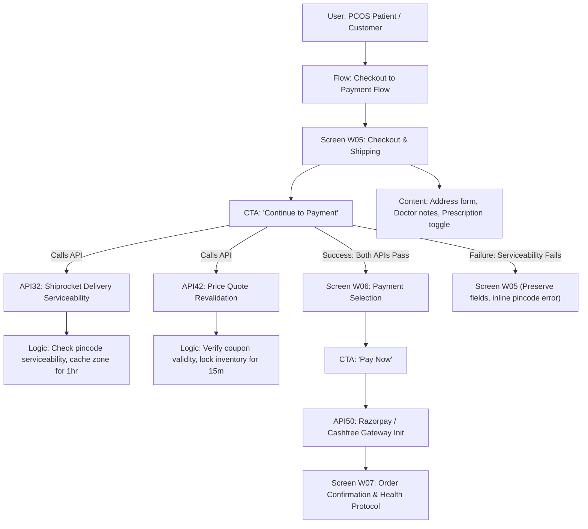

# 07. PCOS Commerce Reference Flow Model

> **Tags**: #pcos #reference-model #benchmark #ground-truth
> **Parent**: [[00_Map_of_Content]]

---

## 🏥 Context & Origin

The reference model is derived from the **PCOS Commerce Application (Annotatory V0.7)**, a real-world complex healthcare/e-commerce flow compiled from a 423-page requirements specification. It serves as our canonical ground-truth testbed.

---

## 🗺️ The Canonical W05 $\to$ W06 Flow Architecture

---

## 🧩 Concrete Node Definitions

### 1. Screen: `W05_CHECKOUT`
- **Owner**: Frontend Lead
- **Status**: `UNDER_REVIEW`
- **What the User Sees**: Delivery address input (pincode, line 1, line 2, city, state), prescription upload toggle, order summary with item breakdown.
- **States**:
  - `Loading`: Skeleton view for order summary and address lookup.
  - `Empty`: Redirect to Cart if 0 items.
  - `Error`: Inline error below pincode input if unserviceable. Form inputs preserved.

### 2. CTA: `CTA_W05_CONTINUE`
- **Label**: "Continue to Payment"
- **Preconditions**:
  - Valid address fields filled.
  - Pincode matches 6 digits regex.
  - Prescription uploaded if prescription-only SKUs present.
- **APIs Dispatched**: `API32_DELIVERY_CHECK`, `API42_QUOTE_REVALIDATE`.
- **On Success**: Navigate to `W06_PAYMENT`.
- **On Failure**: Stay on `W05_CHECKOUT`, highlight failing field, keep all other form entries intact.
- **Debounce**: 500ms; disable button immediately on click to prevent duplicate submission.

### 3. API: `API32_DELIVERY_CHECK`
- **Service**: Logistics Microservice / Vendor: Shiprocket
- **Method**: `POST /api/v1/logistics/serviceability`
- **Timeout**: 3000ms
- **Caching**: 3600s (1 hour) per pincode
- **Questions & Edge Cases**:
  - *Open Question (Backend)*: "If Shiprocket API times out (>3000ms), do we block checkout or allow tentative order placement with manual review?"
  - *Resolution*: Fallback to static serviceable tier-1/tier-2 pincode whitelist; allow checkout to proceed with warning flag in admin queue.

### 4. API: `API42_QUOTE_REVALIDATE`
- **Service**: Pricing & Cart Service
- **Method**: `POST /api/v1/cart/revalidate-quote`
- **Timeout**: 2000ms
- **Idempotency**: Header `X-Idempotency-Key: cart_session_hash` required.
- **Edge Cases**: Flash sale price change during checkout, coupon expiry while on screen.
