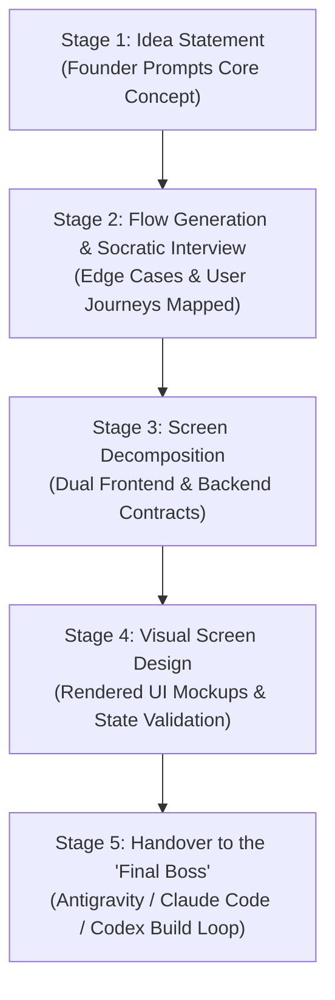

# 10. BuildingBees: The Super Intelligent Product Management System (Master PRD v1.0)

> **Document Status**: Final Architecture Blueprint  
> **Target Audience**: Solo Founders, Product Managers, Engineering Teams  
> **Dual Hackathon Tracks**: Google Cloud AI Builder Cup 2026 & Nebius x NVIDIA Global AI Hackathon  
> **Tags**: #buildingbees #super-intelligence #prd #master-spec #agentic-pm #universal-plugin  
> **Parent**: [[00_Map_of_Content]]

---

## 1. Executive Summary & Vision

**BuildingBees** is the world's first **Super Intelligent Product Management (SI-PM) platform**. It bridges the massive semantic chasm between high-level human ideas and deterministic AI code generation.

Today, AI models write code in seconds, but **what to build** remains broken. Solo founders struggle with ambiguous specs, while teams battle 3-way drift between PRDs, Figma boards, and Jira/Plane backlogs. When specifications omit edge cases, autonomous coding agents ("the builders") don't ask—they hallucinate with supreme confidence.

**BuildingBees** replaces static documentation with an **evolving, 5-stage Socratic software architecture engine**. It acts as a universal plugin for both project management ecosystems (Plane, Jira, Linear) and autonomous agent runtimes (Google Antigravity, Claude Code, OpenAI Codex, Cursor).

---

## 2. The 5-Stage Evolving System Architecture

BuildingBees does not generate a monolithic blob of code from a one-line prompt. Instead, it guides the founder through an **evolutionary Socratic ladder**:

### Stage 1: Idea Ingestion (The Socratic Hook)
- The Lead / Founder inputs a raw, unpolished idea statement (e.g., *"A verified peer-to-peer network for IIT alumni with privacy-first messaging"* or *"A checkout flow for PCOS wellness supplements"*).
- The engine identifies domain archetypes (E-Commerce, Social/Network, SaaS, FinTech, HealthTech) and establishes the initial context envelope.

### Stage 2: Flow Generation & Iterative Socratic Interview
- **Generation**: Decomposes the idea into ordered, logical **User Flows** (e.g., Flow 1: Onboarding & Identity Verification; Flow 2: Cart & Checkout; Flow 3: Post-purchase protocol).
- **Socratic Drilldown**: The engine interrogates the founder with high-signal edge-case questions:
  - *"What happens if a user signs up with a non-institutional email?"*
  - *"If logistics serviceability fails mid-flow, does the user restart or resume?"*
- **Evolution**: The user flows evolve in real-time based on the founder's answers until flow readiness hits 100%.

### Stage 3: Screen Decomposition & Dual Specifications (Frontend & Backend)
Once flows are locked, the engine decomposes each flow step into concrete **Screens**:
- **Frontend Description**:
  - Exact UI layout hierarchy (Header, Content sections, Forms, Feedback banners).
  - Explicit states: `Default`, `Loading Skeleton`, `Empty State`, `Error Container`.
  - **CTAs (The Connective Tissue)**: Buttons and gestures configured as deterministic state machines linking screen actions to backend endpoints.
- **Backend Description**:
  - API endpoints called (Method, Path, Request Schema, Response Schema).
  - Downstream vendor dependencies (e.g. Shiprocket, Stripe, Razorpay).
  - Idempotency policies, SLA timeouts, cache TTLs.
  - Failure paths and error fallback policies.

### Stage 4: Visual Screen Generation & Verification
- Once frontend and backend contracts are solidified, the engine synthesizes **high-fidelity Visual Screens / Wireframes** (SVG/HTML canvas renders).
- The founder reviews and approves the visual UI:
  - Inspects button placement, error states, and responsive layout.
  - Connects CTA arrows visually to success screens and failure routes.
  - No Figma subscription or design tool expertise required.

### Stage 5: Handover to the "Final Boss" (Zero-Hallucination Code Generation)
- With visual screens, frontend schemas, and backend contracts mathematically verified ($Readiness = 1.0$), the complete architectural bundle is handed over to our coding models:
  - **Google Antigravity** (Autonomous Agent IDE)
  - **Claude Code** (CLI agent)
  - **OpenAI Codex / Cursor**
- Because every timeout, error state, and data payload is explicitly defined, the coding agent writes **100% deterministic, regression-free production code** with automated unit & integration tests.

---

## 3. Universal Plugin Ecosystem

BuildingBees is designed as a headless, pluggable intelligence layer that connects to the tools teams already use:

| Ecosystem Type | Integrations Supported | How BuildingBees Interacts |
| :--- | :--- | :--- |
| **Project Management** | **Plane (plane.so)** | Pushes verified flows as Epics, screens as Work Items, and blocking questions as blocker relations via Plane OAuth & MCP. |
| **Project Management** | **Jira & Linear** | Syncs screen/API tickets and auto-updates status when code commits land. |
| **Agentic Coding** | **Google Antigravity** | Native Antigravity Skill / Sidecar providing instant graph context and branch readiness feeds. |
| **Agentic Coding** | **Claude Code & Codex** | Standard Model Context Protocol (MCP) server exposing tools: `get_ready_branches`, `get_node_spec`, `post_blocking_question`. |

---

## 4. Dual Competition Engineering Alignment

### A. Google Cloud AI Builder Cup 2026
- **Gemini 2.0 Pro Multimodal & Thinking**: Powers the Socratic Question Engine and Stage 4 visual UI synthesis.
- **Structured JSON Schema Outputs**: Guarantees zero schema hallucination when generating frontend and backend contracts.
- **Cloud Run Deployment**: High-availability containerized microservice serving the API and interactive canvas.

### B. Nebius x NVIDIA Global AI Hackathon 2026
- **NVIDIA NeMo Guardrails**: Enforces the foundational protocol **"Assumption is not approval"**. Coding agents are mathematically blocked by Colang guardrails from guessing missing specs.
- **NVIDIA cuGraph**: Sub-millisecond GPU-accelerated dependency graph and blast-radius analysis across thousands of screens and microservices.
- **Nebius Open Model Endpoints**: High-throughput inference for parallel multi-node Socratic checks.

---

## 5. Mathematical Readiness & Stop-Rule Metric

$$\text{Readiness}(Branch) = \begin{cases} 0.0 & \text{if } \exists \, q \in \text{Questions}(Branch) \text{ where } q.\text{isBlocking} = \text{true} \\ \frac{\sum_{n \in Branch} \text{Completeness}(n)}{|Branch|} & \text{otherwise} \end{cases}$$

- **The Stop Rule**: If an agent hits an unstated parameter (e.g. unknown timeout), it is forbidden from assuming a default. It must post a blocking question to the founder and pivot to an unblocked branch.

---

## 6. MVP Functional Requirements

1. **Natural Language Idea Input**: Single prompt bar initializing the project session.
2. **Interactive Flow Visualizer**: Step-by-step branching canvas displaying user flows and screens.
3. **Socratic Dialog Engine**: Interactive question cards querying missing states and failure modes.
4. **Dual Spec Viewer**: Side-by-side inspection panel showing Frontend DOM spec and Backend API contract.
5. **FastMCP Server**: Standardized MCP endpoint allowing Antigravity, Claude Code, and Cursor to pull verified branches.
